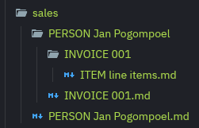

# get-comments
Get marked lines from text file and place these blocks in Markdown files.

## Running get-comments on the command line 
Examples of starting up the get-comments program on the command line

 1. get-comments -dir '/media/gerrie/Media/Workspace/rust/get-comments/src' -work 'documents' -start //# -path EPIC.ITEM.TEST -ext .rs
    - get all get all the blocks of lines starting with `//#` in the `dir` location and scan recursifly all files with .rs extention and put these in Markdown files.

 2. get-comments -dir '.' -work 'sales' -start '.' -path 'PERSON.INVOICE.ITEM' -ext '.txt'
    - get all get all the blocks of lines starting with `.` in the `dir` location and scan recursifly all files with .txt extention and put these in Markdown files.
    
##  Command line parameter breakdown
-dir
 - The root folder of the files to be scanned recursivly. 
  
-work
 - The root of the working folder where is md files will be placed into.
 
-start
 - The string that when it is at the start of a trimmed line indicate that this line must be extracted.

-path
 - The permitted start of path strings and also define the depth of folders permitted.
 
-ext
 - The extention of the files that may be scanned in the `-dir`
 
## Format of first line of block of text
Example 2. 

_.**PERSON** Jan Pogompoel.**INVOICE** 001.**ITEM** line items [0]_

This created the following structure in the file system:



The file _ITEM line items_ is ./testdata/sales/PERSON Jan Pogompoel/INVOICE 001/***ITEM line items.md***. The content of this file is the following:

```
[SOURCE FILE:](file:///./text-test-data2.txt) LINE: 5

# Borsel
blou een

[SOURCE FILE:](file:///./text-test-data2.txt) LINE: 9

# vlos
20 meter

[SOURCE FILE:](file:///./text-test-data2.txt) LINE: 13

# Seep

[SOURCE FILE:](file:///./text-test-data2.txt) LINE: 16

# Mat
```
You would notice that the content has the references to several other line blocks. The order of these line blocks in the file is determined by the order number appended to the end of the first line in the line block. The format of test are `\[\d+\]`. For example [0],[1],[2],...

The number will determine where in the file these line blocks will appear. Each of these sequence numbers must be unique for a given file and must be an unsigned 16 bit number and is required.

## Example
get-comments -dir '/media/gerrie/Media/Workspace/rust/get-comments/src' -work 'documents' -start //# -path EPIC.ITEM.TEST -ext .rs

#### Explanation
Look in all the rust (.rs) files at `/media/gerrie/Media/Workspace/rust/get-comments/src` recursive for all lines starting with `//#`. Create folders and files in die `documents` folder in die current working folder. All folders and files must start with either 'EPIC', 'ITEM' or 'TEST' with a depth of at mose 3 under `documents`.
